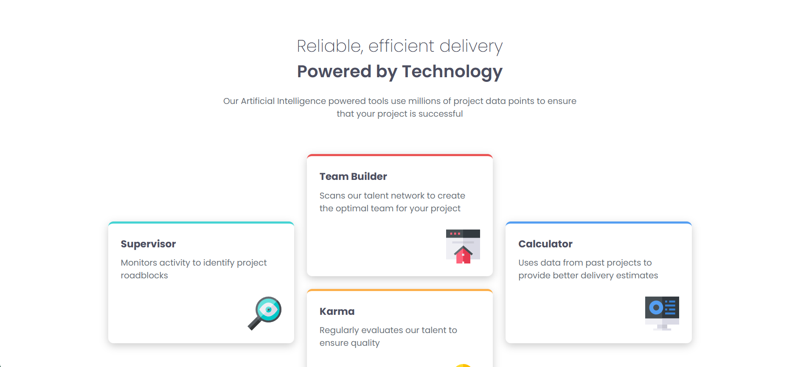
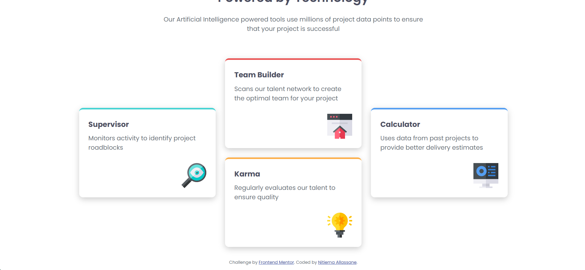
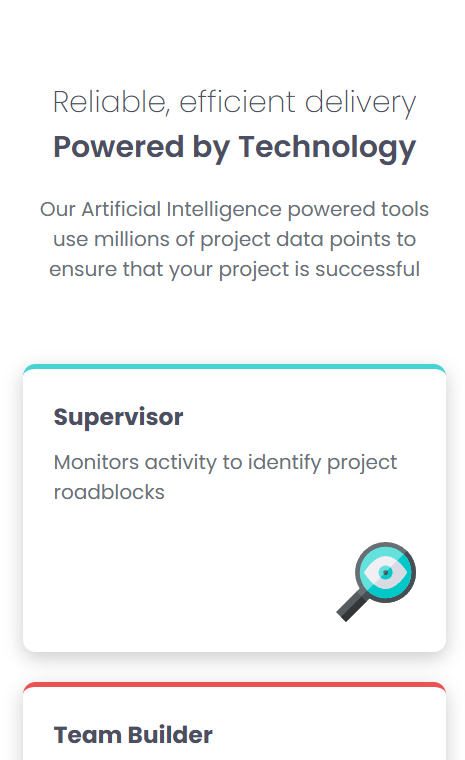
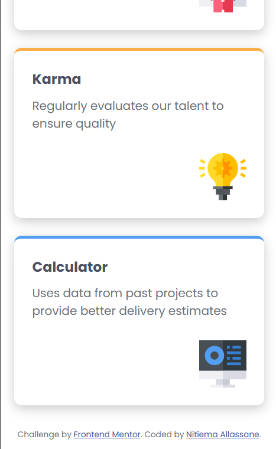

# 🎨 Frontend Mentor - Four Card Feature Section Solution  

Hello there! 👋  

This is my solution for the [Four Card Feature Section challenge on Frontend Mentor](https://www.frontendmentor.io/challenges/four-card-feature-section-weK1eFYK). These challenges are a fantastic way to sharpen your frontend skills by building real-world projects.  

---

## 📌 Table of Contents  

- [Overview](#overview)  
  - [The Challenge](#the-challenge)  
  - [Screenshots](#screenshots)  
  - [Live Demo](#live-demo)  
- [My Process](#my-process)  
  - [Built With](#built-with)  
  - [What I Learned](#what-i-learned)  
  - [Future Improvements](#future-improvements)  
  - [Useful Resources](#useful-resources)  
- [About Me](#about-me)  
- [Acknowledgments](#acknowledgments)  

---

## Overview  

### The Challenge  

Users should be able to:  

✅ View a responsive layout that adapts seamlessly to different screen sizes.  

---

### Screenshots  

#### Desktop View  
  
  

#### 📱 Mobile View  
  
  

---

### Live Demo  

- **Solution URL:** [Card-sections-ui Frontend Mentor](https://www.frontendmentor.io/solutions/feature-cards-built-with-html-and-sass-yXl8BQWic0)  
- **Live Site URL:** [Vercel](https://card-sections-ui.vercel.app/)  

---

## My Process  

### Built With  

- **Semantic HTML5** for better structure and accessibility  
- **Sass** for efficient and scalable styling  
- **CSS Custom Properties** for easier theme management  
- **Flexbox & CSS Grid** for flexible and dynamic layouts  
- **Mobile-First Approach** to ensure great usability on all devices  

---

### What I Learned  

This challenge was a great learning experience! I got hands-on practice with **Sass**, **CSS Grid**, and **Flexbox** to create responsive layouts. Also, I found the **Sass syntax really cool and intuitive!**  

Check out this snippet from my project:  

```scss
@media screen and (max-width: 40em) {
    header {
        h1, h2 {
            font-size: 1.5em;
        }
    }

    main .container .features {
        display: flex;
        flex-direction: column;
        justify-content: center;
        align-items: normal;
    }
}
```

## Future Improvements  

**Optimizing animations & transitions** for a smoother and more engaging user experience.  

**Enhancing accessibility features** to make the project more inclusive and user-friendly.  

**Improving code structure** for better readability, maintainability, and scalability.  

---

## Useful Resources  

- [Sass Official Documentation](https://sass-lang.com/) – This was incredibly helpful for managing styles efficiently with variables, nesting, and mixins.  

---

## About Me  

Hey there! 👋 I'm **Nitiema Allassane**, a passionate web developer constantly exploring new technologies and crafting awesome digital experiences.  

- **Portfolio:** [Your Website Here]  
- **Frontend Mentor:** [@NitiemaDev](https://www.frontendmentor.io/profile/NitiemaDev)  

---

## Acknowledgments  

💡 A huge **thank you** to **Frontend Mentor** for providing such fantastic challenges! These projects are an amazing way to learn, grow, and connect with the developer community.  

👏 Also, a big shout-out to the dev community for their support, inspiration, and all the valuable resources available online!  

---

✨ *Feel free to check out my solution and share your thoughts! Your feedback means a lot. 😊🚀*
